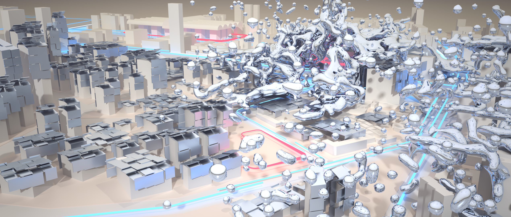

# List Checker

<iframe width="560" height="315" src="https://www.youtube.com/embed/6ARdHSzQCOU" title="YouTube video player" frameborder="0" allow="accelerometer; autoplay; clipboard-write; encrypted-media; gyroscope; picture-in-picture" allowfullscreen></iframe>

---

In the proximity of Huanan Seafood Wholesale Market, the ‘Ground Zero’ site of COVID-19, this commemorative museum project started with a representation of ‘armour suits in the epicentre’ as the intuition. Under this form hypothesis, the multi-objective organization of function and the form-finding of the ‘armour’ becomes the main challenges. The design establishes a generative framework, List Checker, as a means to generate the most appropriate configuration through iterative trials.

Computationally, List Checker asks for a checklist as evaluation criteria for ranking multiple outputs and provides the best outcome. Architecturally, the design logic is translated into expressions, making the output highly reasonable and comprehensive. Spatially, each output crumbles human norms and highlights different unique creative aspects.

---

