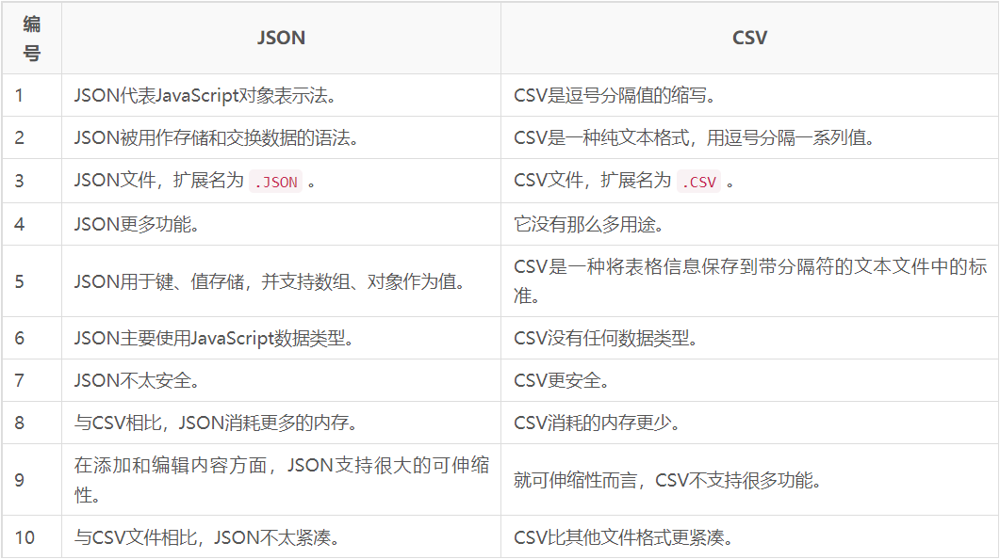

# MAS dfab - Week 7 - Endless Wall

---

Contents

- [What is NCCR DFAB](#what-is-nccr-dfab)
- [NCCR phases](#nccr-phases)
- [What is AEC](#what-is-aec)
- [NCCR principles](#nccr-principles)
- [What you can do](#what-you-can-do)
- [JSON 与 XML：](#json-与-xml)
- [JSON 与 CSV:](#json-与-csv)

---

## What is NCCR DFAB

- 'NCCR' is the SNSF NCCR program
- 'NCCR' is national centers of competence in research (Swiss) which transfers the innovation into practice and industry partners. It is from Swiss National Science Foundation
- Current NCCR: 21, Completed NCCR: 15
- Construction is a bad adaptor of technologies
- Two ways of construction: prefabrication and construction

## NCCR phases

- FT1: digital timber
- FT2: digital concrete
- FT3: digital construction site
- FT4: digital collaboration

## What is AEC

- Architecture Engineering and Construction

## NCCR principles

- Collaboration, Sustainability and Transfer
- We use the things that is the best for it.
- MAS dfab alumni: 115 until now
- This year: contribute, after this year: AEC, future: share

## What you can do

- Peer networking
- Skill training
- Communication
- Career planning
- be dfab

## JSON 与 XML：

JSON 与 XML 的相同之处：

- JSON 和 XML 数据都是 "自我描述" ，都易于理解。
- JSON 和 XML 数据都是有层次的结构
- JSON 和 XML 数据可以被大多数编程语言使用

JSON 与 XML 的不同之处：

- JSON 不需要结束标签
- JSON 更加简短
- JSON 读写速度更快
- JSON 可以使用数组

## JSON 与 CSV:

- 由于 CSV 文件的简单性质，因此解析起来要简单得多，实际上，在一般情况下，对逗号进行简单的拆分会将记录分成几列。 CSV 本质上是一个数组数组或一个哈希表数组，具体取决于您的外观。
- JSON 结构比 CSV 灵活得多，因此解析起来要复杂得多。 每个元素可以无限包含子元素。 JSON 还定义了几种不同的类型。 值可以是字符串，数字，true，false，null，对象或数组。 数组包含 0 个或多个 value 元素。 对象包含键值对，其中键是字符串，并且值如上定义。

  
