# MAS dfab - 3D Printing Architecture

## Goal

- Perforation
- Spatial structures
- Micro structures
- Ornament
- Material properties
- Architecture related
- Composition
- Connectivity
- Pattern generation
- Discrete architecture

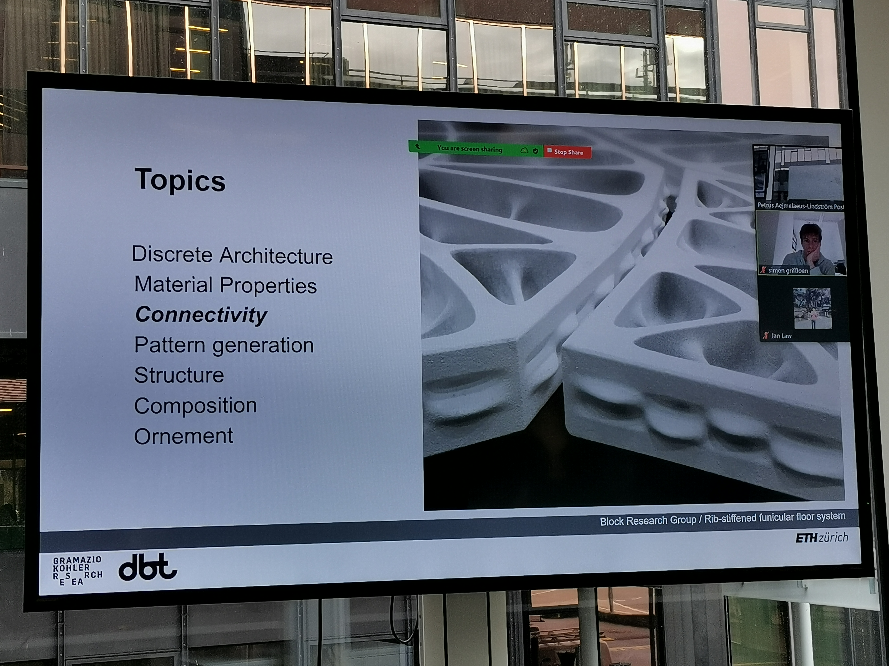

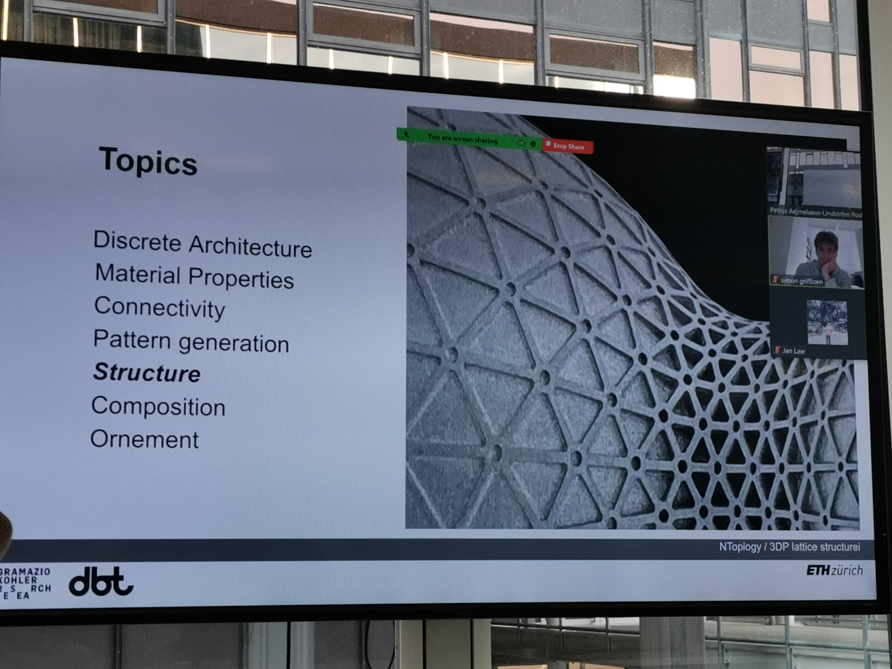

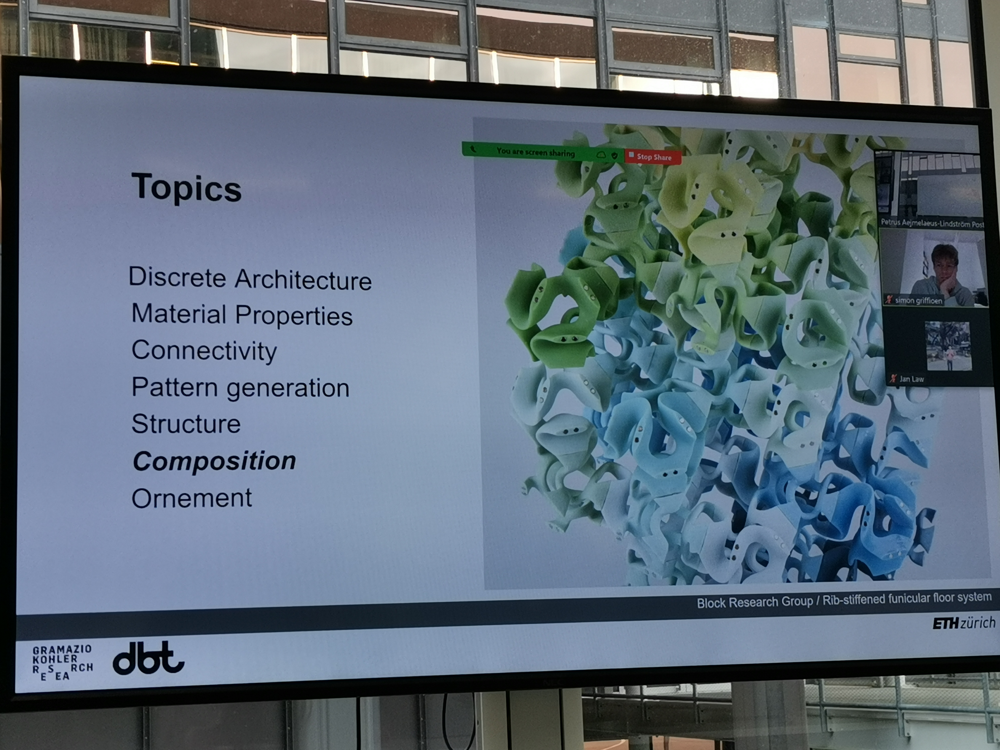

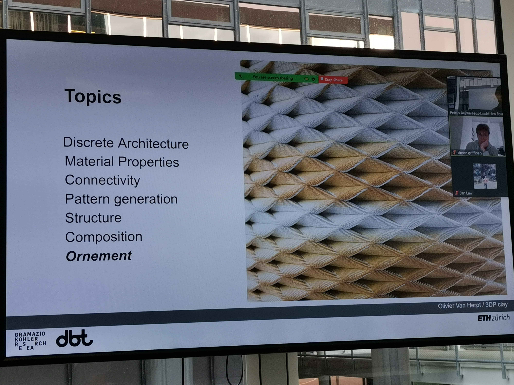

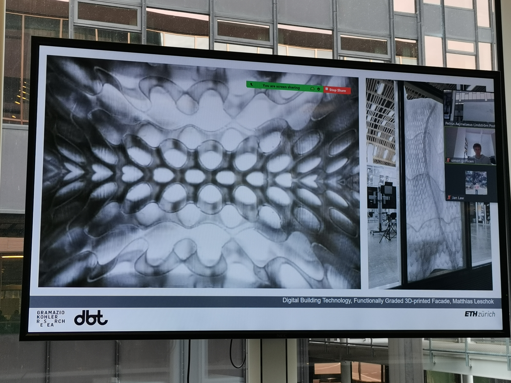

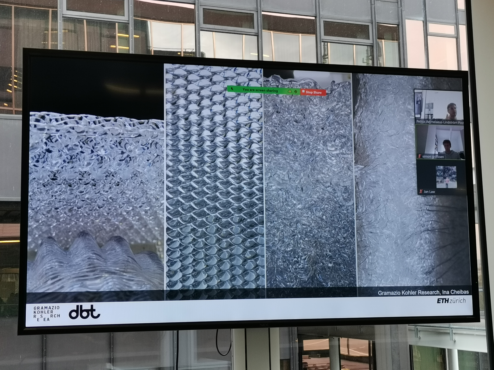

## Joris lecture

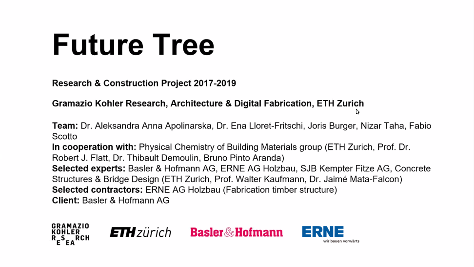

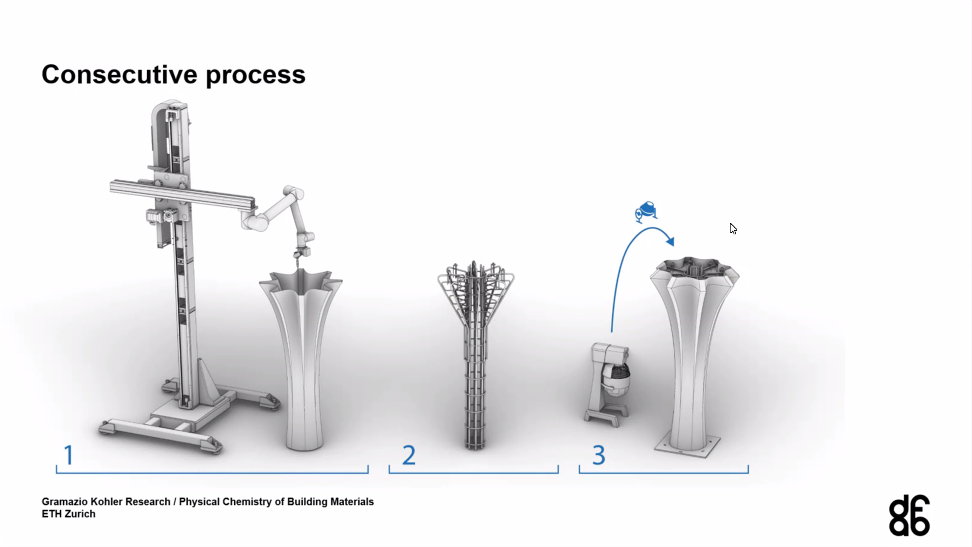

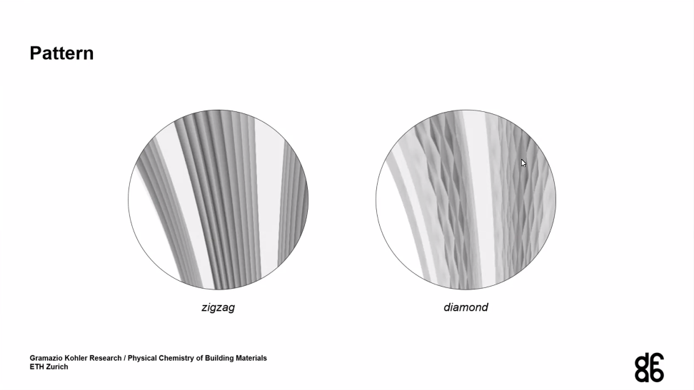
Above: to prevent the shrinkage and span of the 3D printing object

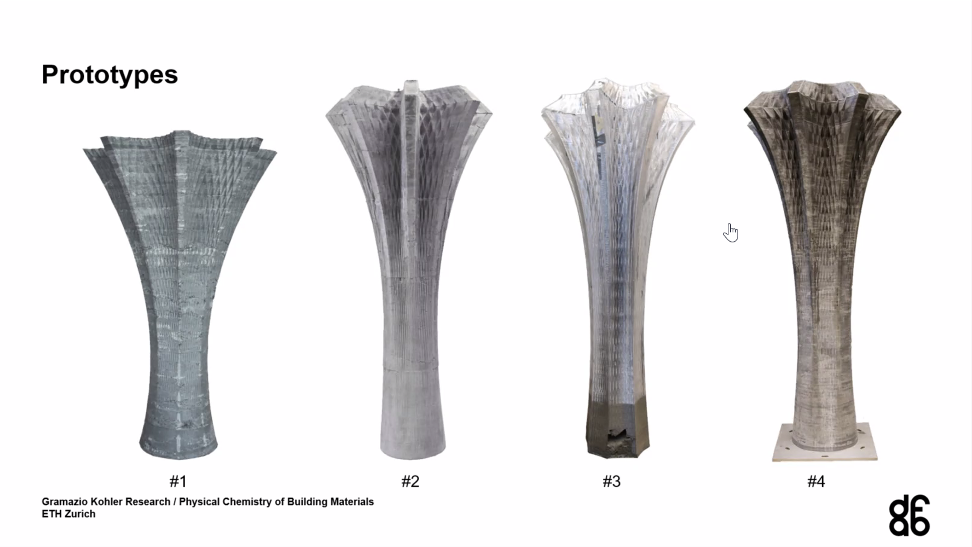

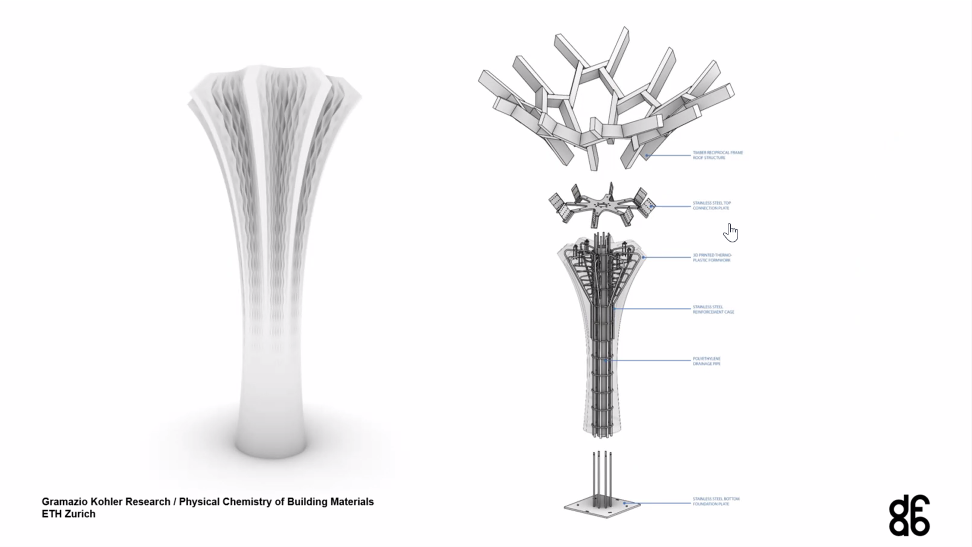

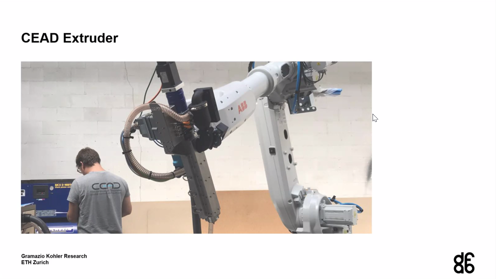

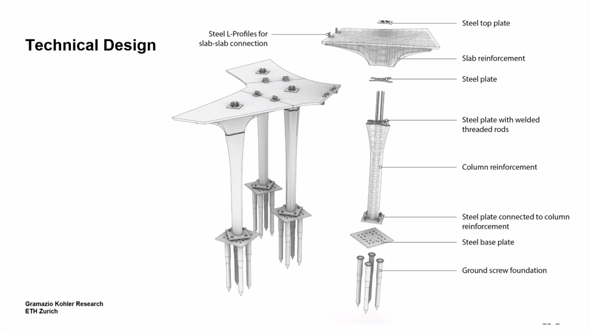
Above: Eggshell pavilion of MAS 2022

## Arduino

