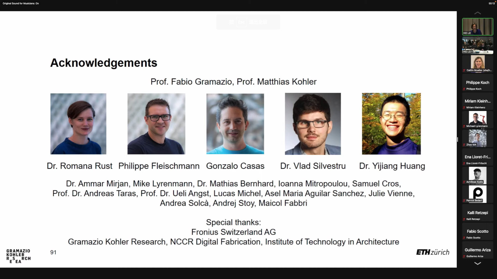

# MAS dfab - 3D Printing Architecture

## Goal

- Perforation
- Spatial structures
- Micro structures
- Ornament
- Material properties
- Architecture related
- Composition
- Connectivity
- Pattern generation
- Discrete architecture

## Joris lecture

Above: to prevent the shrinkage and span of the 3D printing object

Above: Eggshell pavilion of MAS 2022

Above: Eggshell pavilion of MAS 2022

## Arduino

- V = IR
- P = IV
- E = Pt
-
- 
- 
- Phototransistor can be measure if the object is in the front of it.
- 
- 
- 
- 

## Idea for the 'useless machine'
- One andiron that sends the red dot to the 'canvas', but also read the image of the canvas and change its position accordingly. This device can toy with the robots (like Eureka and Dummy). 