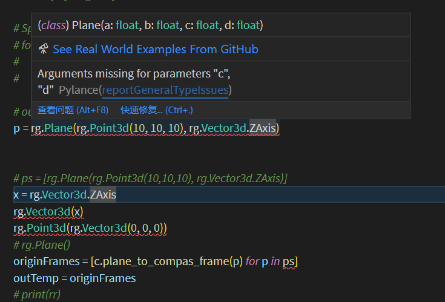
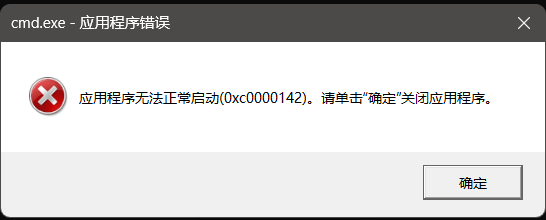
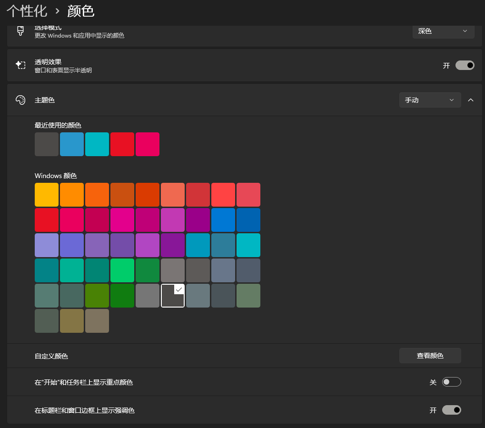
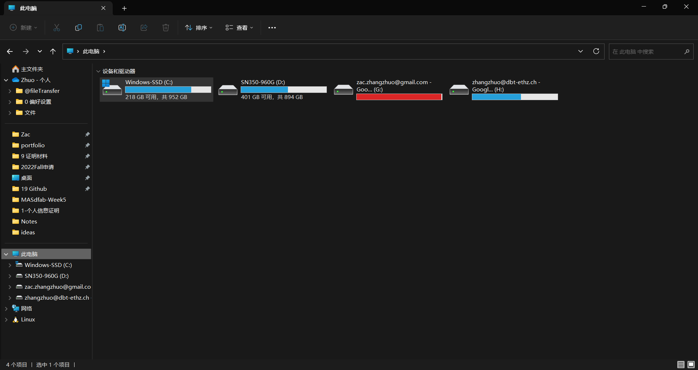
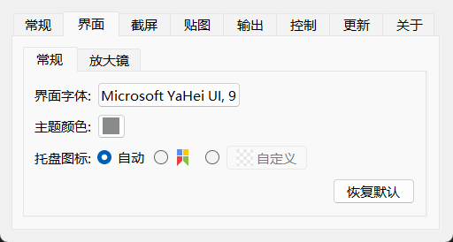
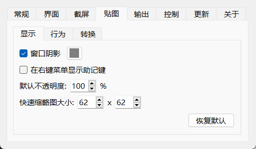
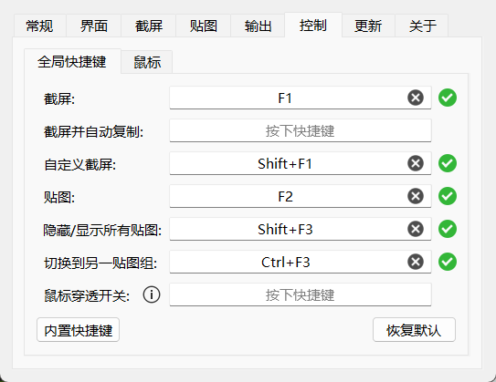
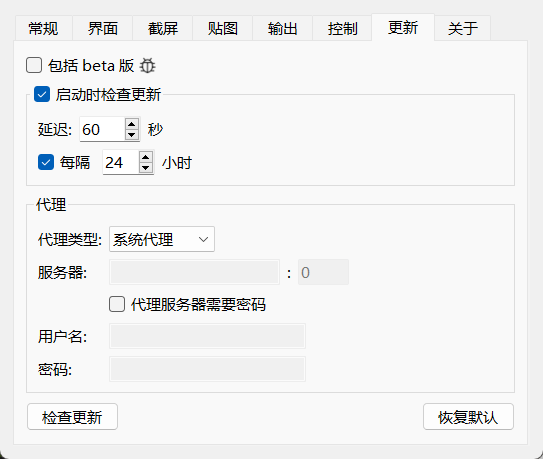
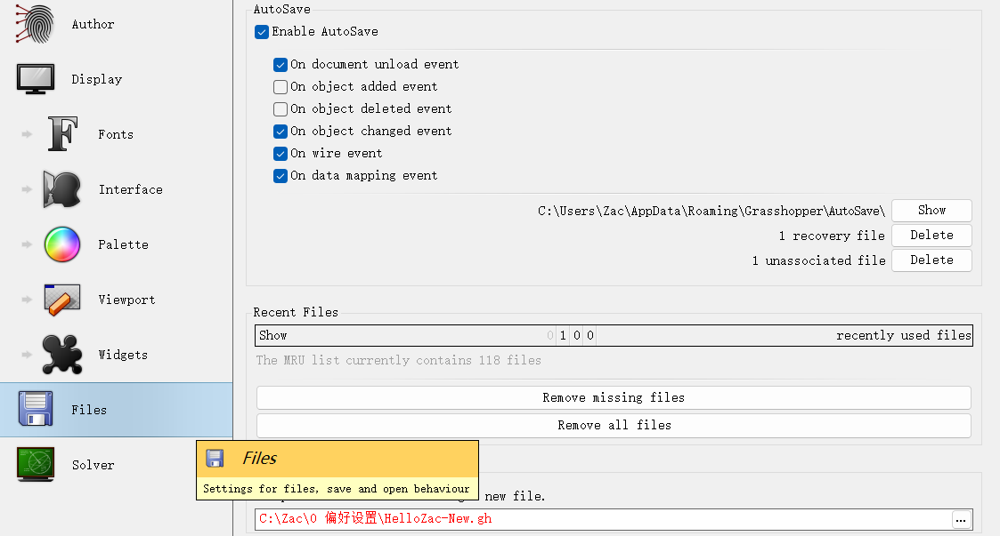

# Windows Reinstallation Plan - 28th Oct

This note is for the first windows reinstallation of the laptop.

---

Content

- [Reasons](#reasons)
- [Before Reinstallation: File Backups](#before-reinstallation-file-backups)
- [After Reinstallation: System Settings](#after-reinstallation-system-settings)
- [After Reinstallation: Uninstall Useless Windows Softwares](#after-reinstallation-uninstall-useless-windows-softwares)
- [After Reinstallation: Basic Logins](#after-reinstallation-basic-logins)
- [After Reinstallation: Applications Installation](#after-reinstallation-applications-installation)
- [After Reinstallation: Set Windows start applications (开机启动的程序)](#after-reinstallation-set-windows-start-applications-开机启动的程序)
- [After Reinstallation: Python Environment](#after-reinstallation-python-environment)
- [After Reinstallation: VSCode Settings](#after-reinstallation-vscode-settings)
- [After Reinstallation: new system backups](#after-reinstallation-new-system-backups)
- [After Reinstallation: Printer Settings](#after-reinstallation-printer-settings)
- [Useful links](#useful-links)
- [Backup Captures](#backup-captures)

---

## Reasons

- all the prompts (CMD, PowerShell, Anaconda Shell, Azure Cloud Shell) fails.
  ```
  [已退出进程，代码为 4294967295 (0xffffffff)]
  [已退出进程，代码为 4294967295 (0xffffffff)]
  [已退出进程，代码为 2 (0x00000002)]
  ```
- VSCode overload function fails
  
- VSCode ghC# Script Parasite cannot load since lack of .NET4.52. However, .NET4.52 cannot be installed since I have had later versions. The only way is to uninstall all the later versions then install .NET4.52.
- 'Code Smile' appears in my laptop. Code: `0x00000000` something.
  
- File categorization is very important: from now on, `C:\` is only for Windows and software applications, `D:\` is for static files.

## Before Reinstallation: File Backups

- [x] Backup all static files like `/Zac; /Photography; `
- [x] Backup office license
- [x] WIFI passwords
- [x] PotPlayer Skin
- [x] VSCode purchased plugins
- [x] VSCode Markdown template
- [x] VSCode settings (eg. paste image default location setting)
- [x] Grasshopper plugins and templates
- [x] Edge settings
- [x] Figure out how to reinstall Snagit 13, Snagit Editor, Bandzip(no advertisement), Pot player, Snipaste
- [x] Backup V2Ray-Core software
- [x] Download all installation packages of all softwares needed
- [x] Exit Windows Beta version

## After Reinstallation: System Settings

- [x] Turn on security boot mode
- [x] Decide default application location
- [x] Initialize all settings (eg. 输入法设置)
- [x] Turn off 小娜
- [x] Windows theme
- [x] Think about wifi/network settings

## After Reinstallation: Uninstall Useless Windows Softwares

- [x] OneNote
- [x] OneDrive (Don't use it anymore, Google Drive will be used)
- [x] McFee
- [x] Windows 小组件
- [x] Xbox series
- [x] Windows 联系人
- [x] 获取帮助
- [x] 旧版 Windows 媒体播放器
- [x] 入门
- [x] 写字板
- [x] Any other useless things: do a check

## After Reinstallation: Basic Logins
- [ ] Download OneNote article and abandon OneNote. Every WeChat article comes to ArchZ website
- [x] Email
- [x] Check terminal (CMD)
- [x] Microsoft Edge (Change settings)

## After Reinstallation: Applications Installation
- [x] Python 3.11
- [x] Office (Official) (Word, Excel, PowerPoint)
- [x] PowerShell
- [x] Chinese language package (only download for emergency, no use, Windows will be in English).

- NVIDIA series:

  - [ ] NVIDIA FrameView SDK 1.3.8 (Check necessities)
  - [x] NVIDIA GeForce Experience 3.26.0.154 (Check necessities)
  - [x] NVIDIA Control Panel (Check necessities)
  - [x] NVIDIA HD 音频驱动程序 1.3.39.14 (Check necessities)
  - [x] NVIDIA PhysX 系统软件 9.21 (Check necessities)
  - [ ] NVIDIA USBC Driver 1.46 (Check necessities)
  - [x] NVIDIA 图形驱动程序 516.94 (Check necessities)
  - [ ] INTEL CORP 因特尔显卡控制中心 (Check necessities)

- .NET series:

  - [ ] .Net 4.5.2 developer Framework
  - [x] Microsoft ASP.NET Core 3.1.3 - Shared FrameView
  - [x] Microsoft Visual C++ 2005 Redistributable 8.0.61101
  - [ ] Microsoft Visual C++ 2015-2022 Redistributable 14.32 x64
  - [ ] Microsoft Visual C++ 2015-2022 Redistributable 14.32 x86
  - [x] .NET SDK 6.0.2
  - [x] .NET 4.8 targeting pack
  - [x] .NET 4.7.1 SDK
  - [x] .NET 4.7.1 targeting pack
  - [ ] Microsoft Visual C++ 2008 Redistributable 9.0.3 x64
  - [ ] Microsoft MPI (7.1.1) (Check necessities)
  - [ ] Microsoft Visual C++ 2005 Redistributable 8.0.59192
  - [ ] Microsoft Visual C++ 2005 Redistributable 8.0.56336
  - [ ] Microsoft Visual C++ 2005 Redistributable 8.0.61000
  - [ ] Microsoft Visual C++ 2005 Redistributable 9.0.30729
  - [x] Microsoft Visual C++ 2010 Redistributable 10.0.4021
  - [ ] DirectX (Check necessities)

- Lenovo series

  - [x] Lenovo Hotkeys
  - [x] Thunderbolt 控制中心 (INTEL CORP)
  - [x] Dolby Vision
  - [ ] 联想驱动管理 2021.12.16.1101 (Check necessities)
  - [x] Dolby Atoms for Gaming
  - [x] Realtek Audio Console (Check necessities)

- Adobe suites

  - [x] Acrobat DC
  - [x] Illustrator
  - [x] Photoshop
  - [x] Premiere
  - [x] Bridge
  - [x] InDesign

- Custom applications
  - [ ] Baidu NetDesk (change settings)
  - [x] Github Desktop
  - [x] Whats App
  - [x] Miro
  - [x] TickTick (滴答清单)
  - [x] Google drive
  - [x] VSCode (stable version)
  - [x] GIT (Check necessities)
  - [x] TIM (Change TIM default record location)
  - [x] Slack
  - [x] Facebook (Edge)
  - [x] Zoom
  - [x] PrusaSlicer 2.5.0
  - [x] City art search
  - [x] DeepL
  - [ ] HiSuite
  - [x] instagram (Edge)
  - [x] YouTube (Edge)
  - [x] Grammarly
  - [x] Blender
  - [x] Snagit 13
  - [x] Snagit Editor
  - [x] Bandzip(no advertisement)
  - [x] Pot player
  - [x] Rhino 7 (setting it well after installation)
  - [ ] Unity (2020.3.20f1c1) (2019.4.36f1c1)
  - [x] 火绒
  - [x] Teams
  - [ ] Epic
  - [x] Autodesk DWG TrueView
  - [x] Touch Designer
  - [x] Google Chrome
  - [x] V2Ray
  - [x] Snipaste
  - [ ] Wangyi Cloud Music
  - [x] Processing
  - [x] WeChat (Change WeChat default record location)
  - [x] WeMeet
  - [ ] 有道词典

## After Reinstallation: Set Windows start applications (开机启动的程序)

- [x] Google Drive
- [x] City art search
- [x] DeepL
- [x] V2Ray
- [x] Snipaste

## After Reinstallation: Python Environment

- [ ] Basics

```
pip install ur-rtde
pip install Rhino-stubs (Also change the 'stubs' file name)

```

- [ ] Compas
- [ ]

## After Reinstallation: VSCode Settings

- [x] Path check

```
  "python.autoComplete.extraPaths": [
  "C:\\Zac\\19 Github",
  "C:\\Applications\\Rhino 7\\Plug-ins\\IronPython\\Lib",
  "C:\\Users\\Zac\\AppData\\Roaming\\McNeel\\Rhinoceros\\7.0\\Plug-ins\\IronPython (814d908a-e25c-493d-97e9-ee3861957f49)\\settings\\lib",
  "C:\\Users\\Zac\\AppData\\Roaming\\McNeel\\Rhinoceros\\7.0\\scripts"

],
"python.analysis.extraPaths": [
  "C:\\Zac\\19 Github",
  "C:\\Applications\\Rhino 7\\Plug-ins\\IronPython\\Lib",
  "C:\\Users\\Zac\\AppData\\Roaming\\McNeel\\Rhinoceros\\7.0\\Plug-ins\\IronPython (814d908a-e25c-493d-97e9-ee3861957f49)\\settings\\lib",
  "C:\\Users\\Zac\\AppData\\Roaming\\McNeel\\Rhinoceros\\7.0\\scripts"
],
```

- [x] Path check of System variables
- [ ]

## After Reinstallation: new system backups

- [x] Backup the Windows registry (注册表)
- [ ] Create Windows system restore origin (系统还原原点)

## After Reinstallation: Printer Settings
- [x] Adobe print to PDF
- [x] Microsoft print to PDF

## Useful links

- [x] 微软Windows https://www.microsoft.com/zh-cn/software-download/windows11
- [x] 如何使用微软官方工具重装Windows系统？https://zhuanlan.zhihu.com/p/414089945?utm_id=0
- [x] 联想驱动管理 https://newsupport.lenovo.com.cn/driveDownloads_index.html
- [x] Windows 小工具 http://lx2021.ysepan.com/
- [x] 新机教程 https://www.zhihu.com/question/46945957/answer/785903684
- [x] 【新 机 攻 略】2020 拯救者新机上手设置和优化】 https://www.bilibili.com/video/BV1uv41117jw/?share_source=copy_web&vd_source=88d6c7daa68bf9e866db376930689e5a
- [x] Bandzip尝试无广告老版本禁用更新 https://zhuanlan.zhihu.com/p/349693729
## Backup Captures



.png)














