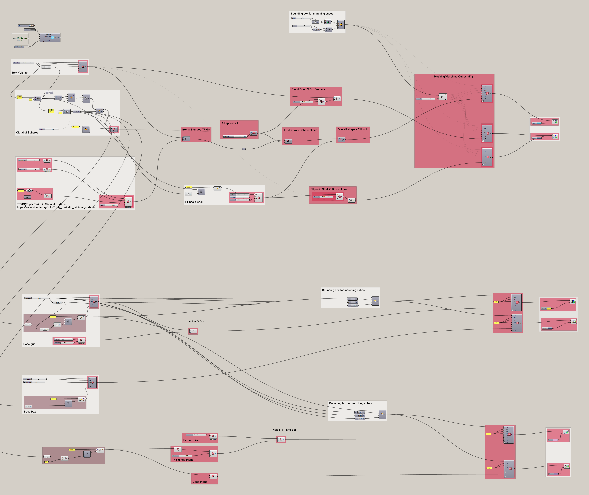

# MAS dfab - Week 5 - Generative City

---

Content

- [Axolotl Subtract](#axolotl-subtract)
- [Axolotl Addition](#axolotl-addition)
- [Axolotl Blend](#axolotl-blend)
- [Axolotl Practice](#axolotl-practice)
- [An interesting note](#an-interesting-note)

---

## Axolotl Subtract


## Axolotl Addition


## Axolotl Blend


## Axolotl Practice




## An interesting note

```Python
    import math
    print (math.sin(30)) #-0.988031624093
    print (math.sin(-18.849556))
    # Python: The outcome is -7.846124032502473e-08
```

```Csharp
    A = Math.Sin(30);//-0.988032
    A = Math.Sin(-18.849556);
    // Csharp: The outcome is -7.8461e-8
```

```java
    println(sin(30)); //-0.9880316
    println(sin(-18.849556));
    // Java: The outcome is -4.7699523E-8
```
