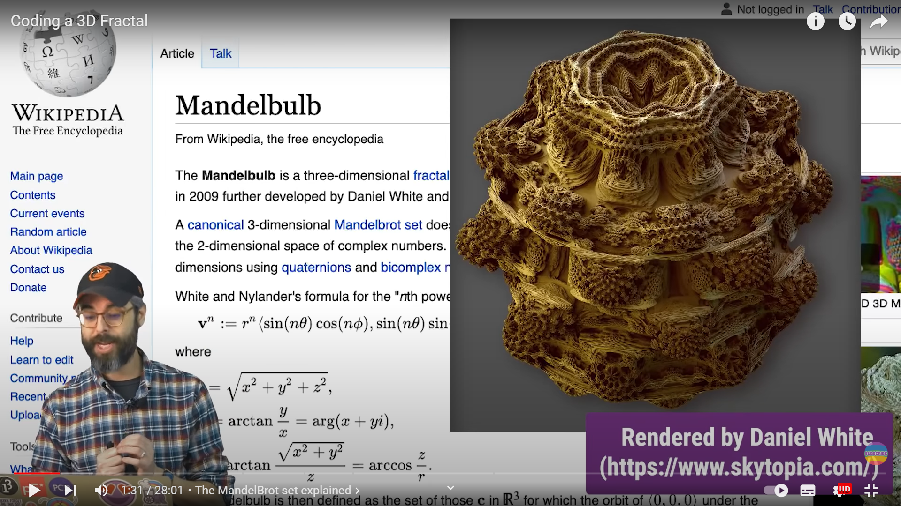

# MAS dfab - Week 5 - Generative City

---

Content

- [Axolotl Subtract](#axolotl-subtract)
- [Axolotl Addition](#axolotl-addition)
- [Axolotl Blend](#axolotl-blend)
- [Axolotl Practice](#axolotl-practice)
- [An interesting note](#an-interesting-note)
- [Processing mandelbrot set](#processing-mandelbrot-set)
- [From processing, do mandelbrot set in Rhino](#from-processing-do-mandelbrot-set-in-rhino)
- [Marching cubes](#marching-cubes)

---

## Axolotl Subtract


## Axolotl Addition


## Axolotl Blend


## Axolotl Practice


## An interesting note

```Python
    import math
    print (math.sin(30)) #-0.988031624093
    print (math.sin(-18.849556))
    # Python: The outcome is -7.846124032502473e-08
```

```Csharp
    A = Math.Sin(30);//-0.988032
    A = Math.Sin(-18.849556);
    // Csharp: The outcome is -7.8461e-8
```

```java
    println(sin(30)); //-0.9880316
    println(sin(-18.849556));
    // Java: The outcome is -4.7699523E-8
```

## Processing mandelbrot set





```Java
    import peasy.*;
    int DIM = 32;
    PeasyCam cam;
    PrintWriter output;

    ArrayList<PVector> mandelbrot = new ArrayList<PVector>();
    // ArrayList<PVector> outMandelbrot = new ArrayList<PVector>();
    int outData[image][image][image] = new int[DIM][DIM][DIM];

    class Spheriacal{
        float r, theta, phi;
        Spheriacal(float r, float theta, float phi) {
            this.r = r;
            this.theta = theta;
            this.phi = phi;
        }
    }

    Spheriacal spheriacal(float x, float y, float z) {
        float r = sqrt(x * x + y * y + z * z);
        float theta = atan2(sqrt(x * x + y * y), z);
        float phi = atan2(y,x);
        return new Spheriacal(r, theta, phi);
    }


    void setup() {
        size(600, 600, P3D);
        
        cam = new PeasyCam(this, 500);
        // !output
        // output = createWriter("C:/Users/Zac/Desktop/positions.txt");
        
        // Ball
        for (int i = 0; i < DIM; i++) {
            for (int j = 0; j < DIM; j++) {
                boolean edge = false;
                for (int k = 0; k < DIM; k++) {
                    float x = map(i, 0,DIM, -1,1);
                    float y = map(j, 0,DIM, -1,1);
                    float z = map(k, 0,DIM, -1,1);
                    
                    PVector zeta = new PVector(0,0,0);
                    
                    
                    int interation = 0;
                    int maxInteration = 10;
                    
                    int n = 8;
                    
                    while(true) {
                        
                        Spheriacal spheriacalZ = spheriacal(zeta.x,zeta.y,zeta.z);
                        float newx = pow(spheriacalZ.r,n) * sin(spheriacalZ.theta * n) * cos(spheriacalZ.phi * n);
                        float newy = pow(spheriacalZ.r,n) * sin(spheriacalZ.theta * n) * sin(spheriacalZ.phi * n);
                        float newz = pow(spheriacalZ.r,n) * cos(spheriacalZ.theta * n);
                        
                        zeta.x = newx + x;
                        zeta.y = newy + y;
                        zeta.z = newz + z;
                        
                        interation++;
                        
                        if (spheriacalZ.r > 16) {
                            if (edge)edge = false;
                            // println (i+"x"+j+"x"+k);
                            // outMandelbrot.add(new PVector(100 * x, 100 * y, 100 * z));
                            outData[i][j][k] = 0;
                            // output.println(outData[i][j][k]);
                            break;
                        }
                        
                        if (interation > maxInteration) {
                            //println (i+"x"+j+"x"+k);
                            // if (!edge)
                            // {
                            // edge = true;
                            
                            // println(new PVector(100 * x, 100 * y, 100 * z));
                        // }
                            // stroke(255, 255, 255);
                            mandelbrot.add(new PVector(100 * x, 100 * y, 100 * z));
                            outData[i][j][k] = 1;
                            // output.println(outData[i][j][k]);
                            break;
                        }
                        
                    }
                }
            }
        }
        
        
        // println(t);
        // println ( DIM*DIM*DIM);
        // println (mandelbrot.size()+outMandelbrot.size());
    }

    void draw() {
        background(0);  
        stroke(255, 255,255);
        for (PVector v : mandelbrot) {
            point(v.x, v.y, v.z);
        }
    }

    // void keyPressed() {
    //     output.flush(); // Writes the remaining data to the file
    //     output.close(); // Finishes the file
    //     exit(); // Stops the program
    // }

```

## From processing, do mandelbrot set in Rhino


```Python

    import mola
    import math
    from mola import module_rhino
    from ghpythonlib import treehelpers

    dim = int(math.floor(len(Values) ** (1 / 3) + 0.0001))


    # ! Too tree
    facesArray = [image]
    lineArray = [image]
    for i in range(dim):
        facesArray.append(Values[dim*dim * i : dim*dim * (i + 1)])

    for face in facesArray:
        tempArray = [image]
        for i in range(dim):
            tempArray.append(face[dim * i : dim * (i + 1)])
        lineArray.append(tempArray)
    # ! End to tree

    for i in range(dim):
        for j in range(dim):
            for k in range(dim):
                lineArray[0][j][k]=0
                lineArray[-1][j][k] =0
                lineArray[i][0][k]=0
                lineArray[i][-1][k] =0
                lineArray[i][j][0]=0
                lineArray[i][j][-1] =0
                

    # ! Too list
    values = [image]
    for i in range(dim):
        for j in range(dim):
            for k in range(dim):
                values.append(lineArray[i][j][k] )
    # x = treehelpers.list_to_tree(lineArray)

    # print (len(values))
    cubes = mola.mesh_marching_cubes(dim, dim, dim, values, 0.5)
    cubes.update_topology()
    mola.color_faces_by_vertical_angle(cubes.faces)

    outTemp = module_rhino.display_mesh(cubes)

```


## Marching cubes


